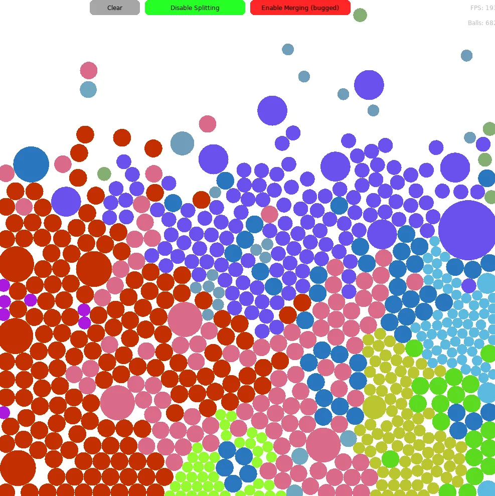

# BallSimulation

A simple and interactive ball simulation built using [Lua](https://www.lua.org/), [LÖVE2D](https://love2d.org/), and [SUIT](https://github.com/vrld/SUIT) (Simple UI Toolkit for LÖVE). This project demonstrates basic physics, collision, and UI interaction in a LÖVE2D environment.



## Features

- **Multiple Bouncing Balls:** Watch balls bounce and interact with each other and the environment.
- **Physics Simulation:** Basic gravity, collision detection, and response.

## Getting Started

### Prerequisites

- [LÖVE2D](https://love2d.org/) 11.x or newer
- [Lua](https://www.lua.org/) (optional, if you want to run standalone scripts)
- [SUIT](https://github.com/vrld/SUIT) (UI library for LÖVE2D, included as a submodule or in the `libs` folder)

### Running the Simulation

1. **Clone the Repository:**
    ```bash
    git clone https://github.com/JameDevOfficial/BallSimulation.git
    cd BallSimulation
    ```

2. **Run with LÖVE2D:**
    - On Windows: Drag the project folder onto `love.exe`
    - On Mac/Linux:  
      ```bash
      love .
      ```

### Controls

- **Add Ball:** Click on the empty white screen
- **Remove Balls:** Click "Clear"
- **Toggle Splitting and Merging:** Click "Enable/Disable Splitting/Merging"
